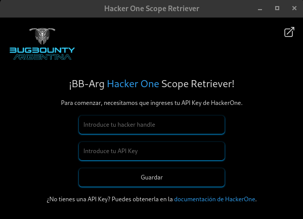

# BB-Arg H1 Scope Retriever



BB-Arg H1 Scope Retriever es una extensión de navegador que facilita la obtención de los detalles de alcance de los programas de HackerOne. Con esta herramienta, puedes buscar y descargar fácilmente los dominios disponibles para pruebas dentro de los programas de bug bounty.

## Instalación Manual

### Google Chrome / Edge (Modo Desarrollador)

1. **Descargar o Clonar el Repositorio**
   ```sh
   git clone https://github.com/tuusuario/bb-arg-h1-scope-retriever.git
   cd bb-arg-h1-scope-retriever
   ```
2. **Compilar la Extensión**

   - Asegúrate de tener instalado `pnpm` y las dependencias:
     ```sh
     pnpm install
     pnpm run build
     ```
   - Esto generará los archivos necesarios en la carpeta `dist/`.

3. **Cargar la Extensión en el Navegador**
   - Abre Chrome y ve a `chrome://extensions/`.
   - Habilita el **Modo Desarrollador** (esquina superior derecha).
   - Haz clic en **Cargar extensión sin empaquetar** y selecciona la carpeta `dist/`.
   - La extensión se añadirá y estará lista para usarse.

### Firefox (Modo Desarrollador)

1. **Descargar o Clonar el Repositorio** (mismo paso que en Chrome).
2. **Compilar la Extensión** (mismo paso que en Chrome).
3. **Cargar la Extensión**
   - Abre Firefox y ve a `about:debugging#/runtime/this-firefox`.
   - Haz clic en **Cargar complemento temporal**.
   - Selecciona el archivo `manifest.json` dentro de la carpeta `dist/`.
   - La extensión estará lista para usarse hasta que cierres el navegador.

## Uso

1. **Configura la API Key**
   - Agrega tu API Key de HackerOne en la configuración de la extensión.
2. **Buscar Programas**

   - Ingresa tu handle de HackerOne y selecciona un programa del listado.

3. **Descargar el Alcance**
   - Al hacer clic en un programa, la extensión recuperará los activos disponibles y generará un archivo `.txt` con los dominios en alcance.

## Contribuciones

Si deseas contribuir al desarrollo, por favor:

- Crea un **fork** del repositorio.
- Crea una nueva **rama** (`feature/nueva-funcionalidad`).
- Realiza un **pull request** cuando esté lista la mejora.

## Licencia

Este proyecto está bajo la licencia MIT.
